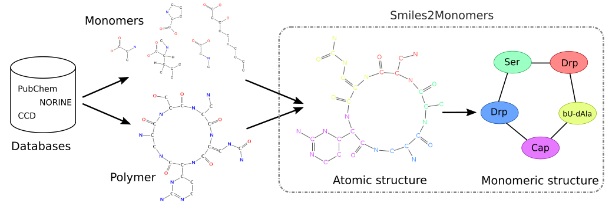

# PhD thesis: Algorithmic for automatic annotations of Non Ribosomal Peptides

{:.image}

## Abstract

The monomeric composition of polymers is powerful for structure comparison and synthetic
biology, among others. However, most of the online molecular resources only provide
atomic structures but not monomeric structures. So, I designed a software called
smiles2monomers (s2m) to infer monomeric structures from chemical ones.  

The underlying algorithm is composed of two steps: a search of the monomers using
a subgraph isomorphism algorithm fitted to data and a tiling algorithm to obtain the
best coverage of the polymer by non-overlapping monomers. The search is based on a
Markovian index improving the execution time by 30% compared to the state of art. The
tiling is performed using a greedy algorithm refined by a “branch & cut” algorithm. s2m
had been tested on two different already annotated datasets. The software reconstructed
the manual annotations with an excellent sensibility in a very short time.  

Norine database, the reference knowledge base about specific polymers called Non Ribosomal
Peptides (NRP), is developed by the bonsai research group. s2m, executed on the Norine
database, alerted us about wrong manual annotations. So, s2m not only creates new annotations,
but also facilitates the process of annotation curation. The new annotations
generated by the software are currently used for the discovery of new NRP, new activities
and may be used to create completely new and artificial NRP.

## Related publications
Y. Dufresne, L. Noé, V. Leclère, M. Pupin, **Smiles2Monomers: a link between
chemical and biological structures for polymers**, J. of Cheminformatics (2016), [link](https://www.ncbi.nlm.nih.gov/pubmed/26715946)  

M. Pupin, Q. Esmaeel, A. Flissi, Y. Dufresne, P. Jacques, V. Leclère, **Norine: a
powerful resource for novel nonribosomal peptide discovery**, Synth. and Sys.
Biotech. (2015), [link](http://www.sciencedirect.com/science/article/pii/S2405805X15300144)  

A. Flissi, Y. Dufresne, J. Michalik, L. Tonon, S. Janot, L. Noé, P. Jacques, V.
Leclère, M. Pupin, **Norine, the knowledgebase dedicated to non-ribosomal
peptides, is now open to crowdsourcing**, Nuc. Acids Res. (2015), [link](http://nar.oxfordjournals.org/content/44/D1/D1113.short)  

## Links
Thesis manuscript (in french): <https://yoann-dufresne.github.io/Thesis/manuscrit.pdf>  
Smiles2Monomers: <http://bioinfo.lifl.fr/norine/smiles2monomers.jsp>  
Source code: <https://github.com/yoann-dufresne/Smiles2Monomers>  
